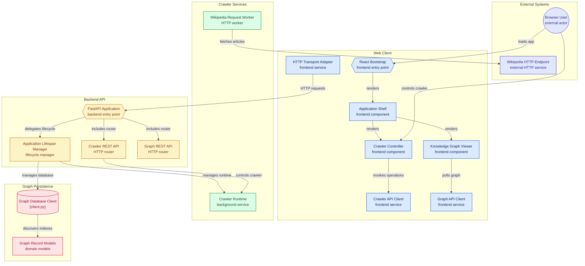

# Architecture

The APP has two major segments:
1. **Frontend**: ReactJS
2. **Backend**: Python

*The current architecture, last updated 18-09-2026.*

```mermaid
flowchart TD

subgraph group_web_client["Web Client"]
  node_react_bootstrap{{"React Bootstrap<br/>frontend entry point"}}
  node_application_shell["Application Shell<br/>frontend component"]
  node_crawler_controller["Crawler Controller<br/>frontend component"]
  node_crawler_api_client["Crawler API Client<br/>frontend service"]
  node_knowledge_graph_viewer["Knowledge Graph Viewer<br/>frontend component"]
  node_graph_api_client["Graph API Client<br/>frontend service"]
  node_http_transport_adapter["HTTP Transport Adapter<br/>frontend service"]
end

subgraph group_backend_api["Backend API"]
  node_fastapi_application{{"FastAPI Application<br/>backend entry point"}}
  node_lifespan_manager["Application Lifespan Manager<br/>lifecycle manager"]
  node_crawler_rest_api["Crawler REST API<br/>HTTP router"]
  node_graph_rest_api["Graph REST API<br/>HTTP router"]
end

subgraph group_crawler["Crawler Services"]
  node_crawler_runtime["Crawler Runtime<br/>background service"]
  node_wikipedia_request_worker["Wikipedia Request Worker<br/>HTTP worker"]
end

subgraph group_persistence["Graph Persistence"]
  node_graph_record_models["Graph Record Models<br/>domain models"]
  node_graph_db_client[("Graph Database Client<br/>[client.py]")]
end

subgraph group_external["External Systems"]
  node_browser_user(("Browser User<br/>external actor"))
  node_wikipedia_endpoint["Wikipedia HTTP Endpoint<br/>external HTTP service"]
end

node_browser_user -->|"loads app"| node_react_bootstrap
node_react_bootstrap -->|"renders"| node_application_shell
node_application_shell -->|"renders"| node_crawler_controller
node_application_shell -->|"renders"| node_knowledge_graph_viewer
node_browser_user -->|"controls crawler"| node_crawler_controller
node_crawler_controller -->|"invokes operations"| node_crawler_api_client
node_knowledge_graph_viewer -->|"polls graph"| node_graph_api_client
node_http_transport_adapter -->|"HTTP requests"| node_fastapi_application
node_fastapi_application -->|"delegates lifecycle"| node_lifespan_manager
node_fastapi_application -->|"includes router"| node_crawler_rest_api
node_fastapi_application -->|"includes router"| node_graph_rest_api
node_lifespan_manager -->|"manages runtime"| node_crawler_runtime
node_lifespan_manager -->|"manages database"| node_graph_db_client
node_crawler_rest_api -->|"controls crawler"| node_crawler_runtime
node_wikipedia_request_worker -->|"fetches articles"| node_wikipedia_endpoint
node_graph_db_client -->|"discovers indexes"| node_graph_record_models

click node_react_bootstrap "https://github.com/skyhui04/wiki-crawler/blob/main/frontend/src/main.tsx"
click node_application_shell "https://github.com/skyhui04/wiki-crawler/blob/main/frontend/src/App.tsx"
click node_crawler_controller "https://github.com/skyhui04/wiki-crawler/blob/main/frontend/src/features/crawler_controller/components/CrawlerController.tsx"
click node_crawler_api_client "https://github.com/skyhui04/wiki-crawler/blob/main/frontend/src/services/crawler.ts"
click node_knowledge_graph_viewer "https://github.com/skyhui04/wiki-crawler/blob/main/frontend/src/features/knowledge_graph/KnowledgeGraph.tsx"
click node_graph_api_client "https://github.com/skyhui04/wiki-crawler/blob/main/frontend/src/services/graph.ts"
click node_http_transport_adapter "https://github.com/skyhui04/wiki-crawler/blob/main/frontend/src/services/server.ts"
click node_fastapi_application "https://github.com/skyhui04/wiki-crawler/blob/main/backend/app/main.py"
click node_lifespan_manager "https://github.com/skyhui04/wiki-crawler/blob/main/backend/app/core/lifespan.py"
click node_crawler_rest_api "https://github.com/skyhui04/wiki-crawler/blob/main/backend/app/routers/v1/crawler.py"
click node_graph_rest_api "https://github.com/skyhui04/wiki-crawler/blob/main/backend/app/routers/v1/graph.py"
click node_crawler_runtime "https://github.com/skyhui04/wiki-crawler/blob/main/backend/app/services/crawler.py"
click node_wikipedia_request_worker "https://github.com/skyhui04/wiki-crawler/blob/main/backend/app/services/wiki_query.py"
click node_graph_record_models "https://github.com/skyhui04/wiki-crawler/tree/main/backend/app/models"
click node_graph_db_client "https://github.com/skyhui04/wiki-crawler/blob/main/backend/app/db/client.py"

classDef toneNeutral fill:#f8fafc,stroke:#334155,stroke-width:1.5px,color:#0f172a
classDef toneBlue fill:#dbeafe,stroke:#2563eb,stroke-width:1.5px,color:#172554
classDef toneAmber fill:#fef3c7,stroke:#d97706,stroke-width:1.5px,color:#78350f
classDef toneMint fill:#dcfce7,stroke:#16a34a,stroke-width:1.5px,color:#14532d
classDef toneRose fill:#ffe4e6,stroke:#e11d48,stroke-width:1.5px,color:#881337
classDef toneIndigo fill:#e0e7ff,stroke:#4f46e5,stroke-width:1.5px,color:#312e81
classDef toneTeal fill:#ccfbf1,stroke:#0f766e,stroke-width:1.5px,color:#134e4a
class node_react_bootstrap,node_application_shell,node_crawler_controller,node_crawler_api_client,node_knowledge_graph_viewer,node_graph_api_client,node_http_transport_adapter toneBlue
class node_fastapi_application,node_lifespan_manager,node_crawler_rest_api,node_graph_rest_api toneAmber
class node_crawler_runtime,node_wikipedia_request_worker toneMint
class node_graph_record_models,node_graph_db_client toneRose
class node_browser_user,node_wikipedia_endpoint toneIndigo

```
